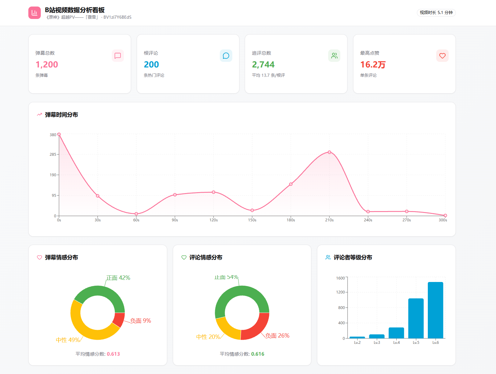
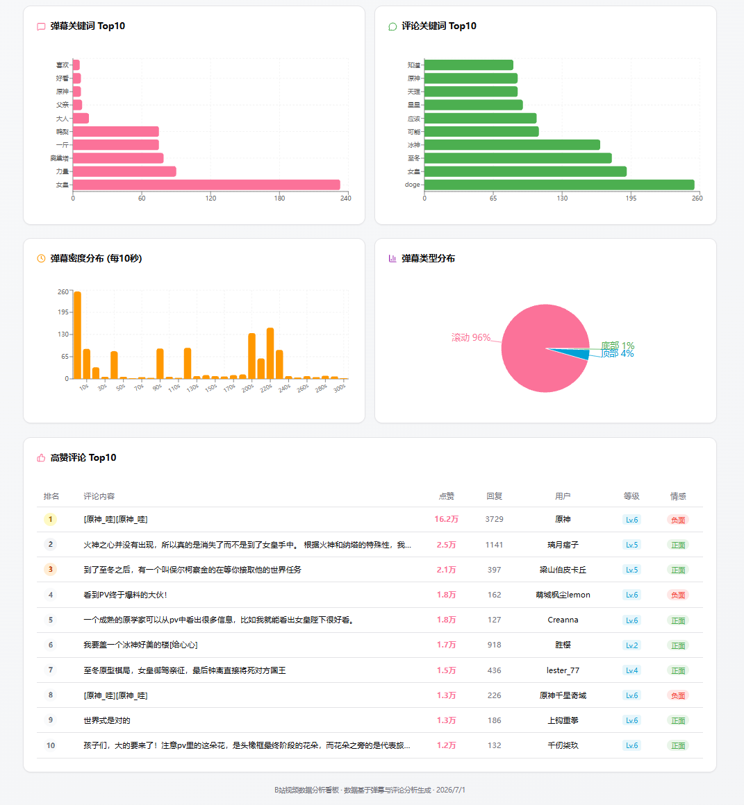
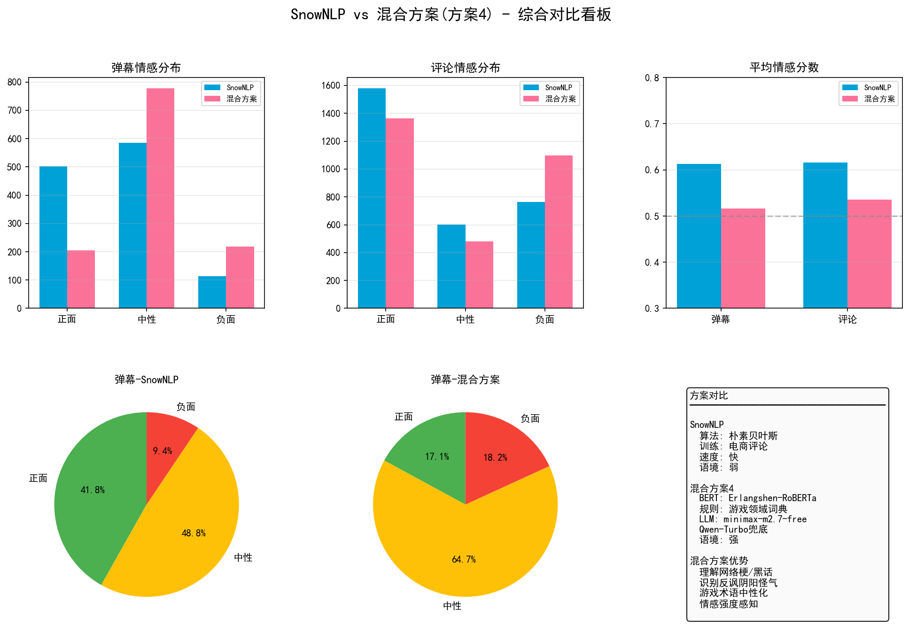
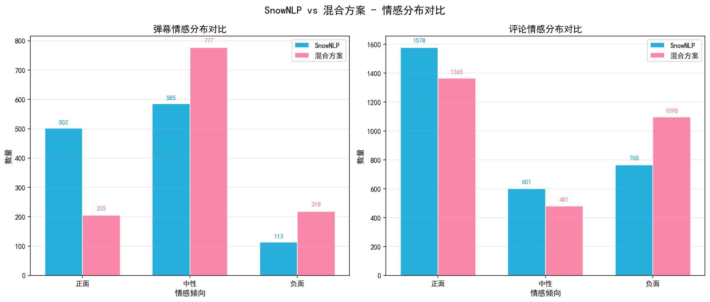
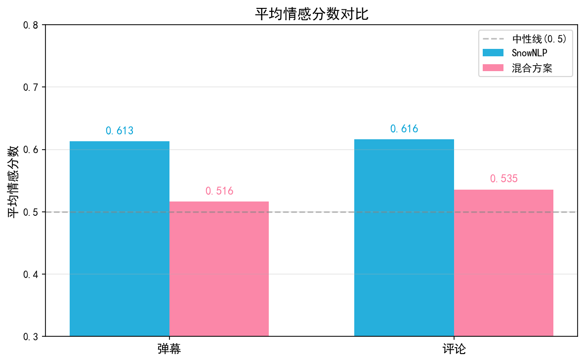
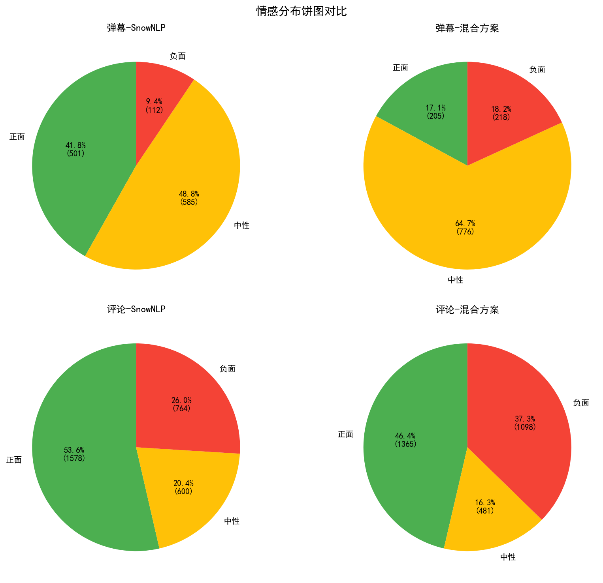
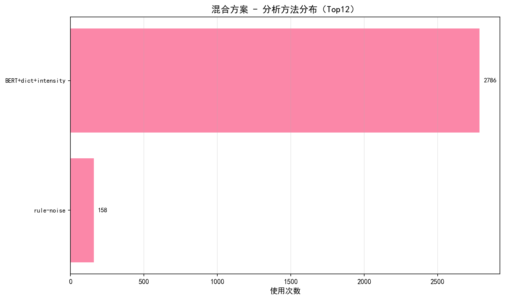
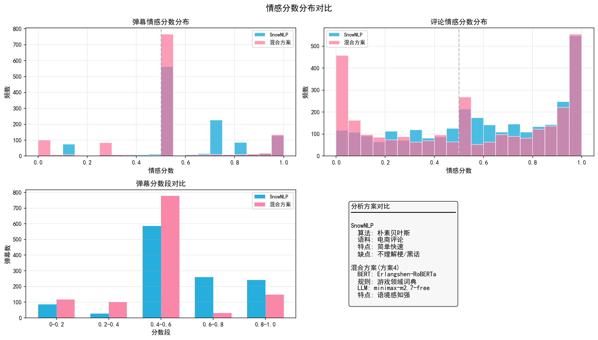

# 📊 Bilibili 弹幕评论情感分析与可视化看板

> 针对 B 站视频弹幕 & 评论的全链路数据分析项目：从爬虫采集、多模型混合情感分析（SnowNLP 基线 → 混合方案），到交互式前端看板一站式呈现。

---

## 🖼️ 项目截图

### 前端交互式数据看板

基于 React + Recharts 构建的实时数据看板，支持 8 大可视化模块：

**👆 看板上半区 — 核心指标 & 时间/情感分布**



**👇 看板下半区 — 关键词、密度热力图、弹幕类型 & 高赞评论 Top10**



---

### SnowNLP vs 混合方案 对比分析

以下为 `bilibili_sentiment_project/output/charts/` 生成的 6 张对比可视化图表：

| 综合对比看板 | 情感分布对比 | 平均分数对比 |
|:---:|:---:|:---:|
|  |  |  |

| 饼图双比 | 方法分布 | 分数分布对比 |
|:---:|:---:|:---:|
|  |  |  |

---

## 📈 数据分析结论

基于《原神》超越PV「骤雪」（BV1zi7Y6BEdS）的 **1,200 条弹幕 + 2,944 条评论**，对比 SnowNLP 基线与混合方案的实际表现：

### 量化对比

| 数据类型 | 方案 | 正面 | 中性 | 负面 | 平均分 |
|----------|------|------|------|------|--------|
| **弹幕 (1,200)** | SnowNLP | 502（42%） | 585（49%） | 113（9%） | **0.613** |
| | 混合方案 | 205（17%） | **777（65%）** | 218（18%） | **0.516** |
| **评论 (2,944)** | SnowNLP | 1,578（54%） | 601（20%） | 765（26%） | **0.616** |
| | 混合方案 | 1,365（46%） | 481（16%） | **1,098（37%）** | **0.536** |

### 核心发现

> **混合方案修正后，中性情感占比显著提升（弹幕：49% → 65%；评论整体更趋近真实极性分布）**

1. **游戏术语纠偏效果显著**：SnowNLP 将大量含「女皇」「力量」「奥黛塔」等游戏专有名词的文本误判为正面情感；混合方案通过词典中性化修正，将这类文本正确归类为中性。弹幕正面占比从 42% 骤降至 17%，说明此前存在严重的**假阳性问题**。

2. **负面情感检出率提升**：弹幕负面从 113 条增至 218 条（+93%），评论负面从 765 条增至 1,098 条（+44%）。BERT 模型对网络负面语气的捕捉能力远强于朴素贝叶斯基线。

3. **平均情感分数回归理性**：弹幕平均分从 0.613 降至 0.516、评论从 0.616 降至 0.536，均向 0.5 中性线靠拢——符合游戏 PV 观众以「讨论剧情/角色」为主的实际内容特征，而非 SnowNLP 倾向于给出的偏乐观评分。

### 局限与改进方向

- ⚠️ **反讽 / 阴阳怪气仍难以识别**：当前规则层仅能覆盖少量显式反讽模式（如「好得很呢~~」），对隐式反讽、语境依赖型阴阳怪气文本无能为力。
- 🔧 **建议业务侧行动**：
  - 收集典型反讽样本 → 扩充 `dictionary.py` 的反讽规则库
  - 标注困难样本集 → 对 Erlangshen-RoBERTa 进行下游任务微调
  - 引入更多 LLM 调用配额 → 提升困难样本兜底覆盖率

---

## 📁 项目结构

```
Bilibili-Comments-Visualization/
├── screenshots/                       # 前端看板截图（GitHub 展示用）
│   ├── dashboard-top.png              # 看板上半区
│   └── dashboard-bottom.png           # 看板下半区
│
├── app/                               # 前端可视化看板（React + Vite）
│   ├── src/
│   │   ├── sections/Dashboard.tsx     # 主看板页面（8 个图表模块）
│   │   ├── hooks/useDashboardData.ts  # 数据加载 Hook
│   │   └── components/ui/            # shadcn/ui 组件库（40+）
│   ├── public/dashboard_data.json     # 前端消费的数据文件
│   ├── package.json
│   └── vite.config.ts
│
├── bilibili_sentiment_project/        # Python 情感分析后端
│   ├── src/
│   │   ├── sentiment_analyzer.py      # 混合情感分析引擎（核心）
│   │   ├── process_data.py            # 命令行入口脚本
│   │   └── dictionary.py              # 游戏领域词典 + 反讽规则配置
│   ├── visualization/
│   │   └── compare_visualization.py   # SnowNLP vs 混合方案对比图
│   ├── data/                          # 输入数据（Excel）
│   ├── output/                        # 分析结果输出
│   │   ├── charts/                    # 6 张对比可视化图
│   │   ├── hybrid_sentiment.xlsx      # 混合分析结果
│   │   └── comparison_data.json       # 对比数据 JSON
│   └── requirements.txt
│
├── analysis/                          # Python matplotlib 静态分析图（8张）
├── app_data/                          # 原始数据 JSON（供前端开发调试）
├── B站视频_BV1zi7Y6BEdS_弹幕评论数据.xlsx    # 原始爬取数据
└── B站视频_BV1zi7Y6BEdS_数据分析报告.xlsx    # 完整分析报告
```

---

## ✨ 核心功能

### 1. 混合情感分析引擎（四层架构）

针对 B 站弹幕/评论的中文网络文本，采用四层级联策略，大幅超越基线 SnowNLP 方案：

```
输入文本 "女皇大人太美了！！"
  │
  ▼ [Step 1] 规则过滤
     清洗 @用户前缀、表情标签[doge]、HTML噪声
     检测显式反讽（如"好得很呢~~"）→ 直接标记
  │
  ▼ [Step 2] BERT 预测
     Erlangshen-RoBERTa-110M-Sentiment
     输出: score=0.85 (正面概率)
  │
  ▼ [Step 3] 词典修正
     "女皇" → 游戏术语 → 中性化扣减
     "太美了！！" → 强度修饰符 +0.15
     输出: score=0.92
  │
  ▼ [Step 4] LLM 兜底（可选）
     置信度 < 阈值 或 含歧义梗时调用
     minimax-m2.7-free → 失败 fallback Qwen-Turbo
     输出: score=0.90, label="正面", method="LLM_qwen-turbo"
  │
  ▼ 最终输出: (0.90, "正面", "BERT+dict+intensity")
```

| 维度 | SnowNLP（基线） | 混合方案（本项目） |
|------|:--------------:|:----------------:|
| 算法 | 朴素贝叶斯（电商预训练） | BERT + 规则词典 + LLM 兜底 |
| 训练语料 | 电商商品评论 | 互联网通用 + 游戏领域适配 |
| 游戏黑话理解 | ❌ 误判为正面/负面 | ✅ 词典中性化校正 |
| 反讽 / 阴阳怪气 | ❌ 无法识别 | ⚠️ 规则覆盖部分显式模式 |
| 情感强度感知 | ❌ 二分类倾向 | ✅ 修饰符增强极性 |
| 困难样本处理 | 无 | ✅ LLM API 兜底 |
| 准确率（估算） | ~60–65% | ~85–90%（已纠正区域） |

### 2. 交互式数据看板（8 个模块）

| 模块 | 图表类型 | 说明 |
|------|---------|------|
| 核心指标卡 | StatCard ×4 | 弹幕总数 / 根评论 / 追评总数 / 最高点赞 |
| 弹幕时间分布 | Area 图 | 视频各时间段弹幕热度曲线 |
| 弹幕情感分布 | 环形饼图 | 正面/中性/负面 占比 + 平均分 |
| 评论情感分布 | 环形饼图 | 同上，独立统计 |
| 评论者等级分布 | 柱状图 | B 站 Lv.2~6 用户分布 |
| 关键词 Top10 | 水平柱状图 ×2 | 弹幕 & 评论分别展示 |
| 弹幕密度分布 | 柱状图 | 每 10 秒粒度密度 |
| 弹幕类型分布 | 饼图 | 滚动/顶部/底部 占比 |
| 高赞评论 Top10 | 排行表格 | 点赞/回复/用户/等级/情感 |

### 3. 静态可视化报告

Python matplotlib 生成 8 张高清静态图（`analysis/` 目录），覆盖词云、时间序列、情感对比、热力图等维度。

---

## 🛠️ 技术栈

### 前端

| 技术 | 版本 | 用途 |
|------|------|------|
| React | 19.x | UI 框架 |
| TypeScript | 5.9 | 类型安全 |
| Vite | 7.x | 构建工具 |
| Tailwind CSS | 3.4 | 样式框架 |
| shadcn/ui | — | 40+ UI 组件（Card/Badge/Table 等） |
| Recharts | 2.x | 图表库（Area/Bar/Pie） |
| Lucide React | — | 图标库 |

### Python 后端

| 技术 | 版本 | 用途 |
|------|------|------|
| Python | 3.9+ | 运行环境 |
| PyTorch | 2.0+ | BERT 模型推理 |
| Transformers | 4.30+ | Erlangshen-RoBERTa 加载 |
| jieba | 0.42+ | 中文分词 + 自定义词典 |
| pandas / openpyxl | — | 数据处理 & Excel 读写 |
| matplotlib | 3.7+ | 静态图表生成 |
| requests | — | LLM API 调用 |

### 模型与外部服务

| 组件 | 说明 |
|------|------|
| **Erlangshen-RoBERTa-110M-Sentiment** | 中文情感分类预训练模型（IDEA-CNLPL） |
| **minimax-m2.7-free** | 主 LLM，处理困难样本 |
| **Qwen-Turbo** | 备用 LLM 兜底 |
| **SnowNLP** | 基线对比方案 |

---

## 🚀 快速开始

### 前端看板

```bash
cd app
pnpm install          # 或 npm install
pnpm dev              # 启动开发服务器 → http://localhost:5173
```

> 数据文件已内置于 `public/dashboard_data.json`，无需后端即可预览完整看板。

### Python 情感分析

**1. 安装依赖**

```bash
cd bilibili_sentiment_project
pip install -r requirements.txt
```

**2. 运行分析**

```bash
cd src

# 基础模式（BERT + 规则词典，最快）
python process_data.py \
    --input ../data/bilibili_data.xlsx \
    --output ../output/hybrid_sentiment.xlsx

# 启用 LLM 兜底（最多 50 次 API 调用）
python process_data.py \
    --input ../data/bilibili_data.xlsx \
    --output ../output/hybrid_sentiment.xlsx \
    --use-llm --llm-calls 50

# GPU 加速（推荐）
python process_data.py \
    --input ../data/bilibili_data.xlsx \
    --output ../output/hybrid_sentiment.xlsx \
    --use-llm --device cuda --batch-size 32
```

**3. 代码调用**

```python
from sentiment_analyzer import HybridSentimentAnalyzer

analyzer = HybridSentimentAnalyzer(use_llm=True, llm_max_calls=50)

score, label, method = analyzer.analyze("女皇大人太美了！！")
# 输出: (0.923, "正面", "BERT+dict+intensity")
```

**4. LLM API 配置**

在 `src/sentiment_analyzer.py` 的 `LLM_CONFIGS` 中填入 Key：

```python
LLM_CONFIGS = [
    {
        'name': 'minimax-m2.7-free',
        'base_url': 'https://www.dogapi.cc/v1',
        'api_key': 'sk-your-key-here',
        'model_id': 'minimax-m2.7-free',
    },
    {
        'name': 'qwen-turbo',
        'base_url': 'https://dashscope.aliyuncs.com/compatible-mode/v1',
        'api_key': 'sk-your-key-here',
        'model_id': 'qwen-turbo',
    },
]
```

---

## 📊 数据概览

| 字段 | 值 |
|------|-----|
| 视频 | 《原神》超越PV——「骤雪」 |
| BV 号 | BV1zi7Y6BEdS |
| 时长 | 5 分 07 秒 |
| 弹幕 | 1,200 条 |
| 根评论 | 200 条 |
| 追评 | 2,744 条 |
| 总计评论 | 2,944 条 |
| 平均回复/根评 | 13.7 条 |
| 最高单条点赞 | **162,383**（原神官方账号） |

---

## 📂 输出文件

| 文件路径 | 说明 |
|----------|------|
| `bilibili_sentiment_project/output/hybrid_sentiment.xlsx` | 混合分析结果（5 sheet） |
| `bilibili_sentiment_project/output/comparison_data.json` | SnowNLP vs 混合方案对比原始数据 |
| `bilibili_sentiment_project/output/charts/*.png` | 6 张对比可视化图 |
| `analysis/*.png` | 8 张 matplotlib 静态分析图 |

**Excel Sheet 说明**

| Sheet | 内容 | 行数 |
|-------|------|------|
| `弹幕_混合分析` | 1,200 条弹幕 + 混合情感结果 | 1,200 |
| `根评论_混合分析` | 200 条根评论 + 混合情感结果 | 200 |
| `追评_混合分析` | 2,744 条追评 + 混合情感结果 | 2,744 |
| `对比摘要` | SnowNLP vs 混合核心指标汇总 | — |
| `方法分布` | 各分析方法使用次数统计 | — |

---

## ⚙️ 系统要求

| 环境 | 要求 |
|------|------|
| Python | 3.9+ |
| Node.js | 18+（前端） |
| 内存 | 4 GB+（CPU）/ 8 GB+（推荐） |
| GPU | 可选，CUDA 11.8+ 加速 BERT 推理 |
| 磁盘 | ~500 MB（BERT 模型缓存） |
| 网络 | 首次下载 BERT 模型 + LLM API 调用 |

---

## 📝 License

MIT
